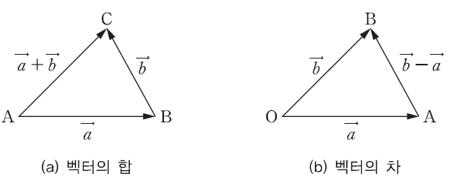

## 1494_사랑의 카운슬러

https://swexpertacademy.com/main/code/problem/problemDetail.do?contestProbId=AV2b_WPaAEIBBASw

#### 1. 조합으로 풀기

> 시간초과 해결 아직 못함

> - 벡터의 합/차
>
>   

```python
def dfs(cnt):
    global temp_list, result

    if cnt == N//2:
        x = 0
        y = 0
        for i in range(N):
            if result <= x or result <= y:
                return

            if i in temp_list:
                x += position_list[i][0]
                y += position_list[i][1]
            else:
                x -= position_list[i][0]
                y -= position_list[i][1]

        temp_result = x**2 + y**2
        if temp_result < result:
            result = temp_result

    else:
        for i in range(N):
            if visited[i]:
                continue

            visited[i] = 1
            temp_list[cnt] = i
            dfs(cnt+1)
            visited[i] = 0

T = int(input())
for test in range(1, 4):
    N = int(input())
    position_list = []
    for _ in range(N):
        a, b = map(int, input().split())
        position_list.append((a, b))

    temp_list = [0] * (N//2)
    visited = [0] * N
    result = float('INF')

    dfs(0)

    print('#{} {}'.format(test, result))
```

