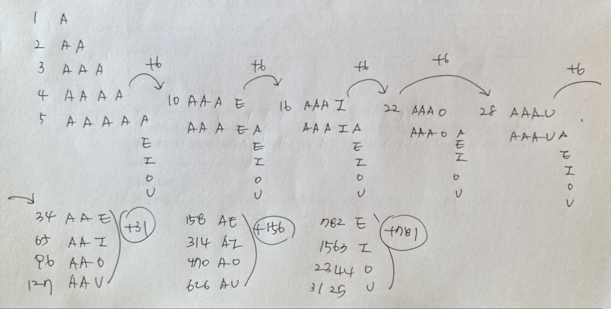

## Lv.2 모음사전

https://programmers.co.kr/learn/courses/30/lessons/84512

#### 1. 문자간 간격 구해서 연산하기
> 
> 
> 시간복잡도: O(n)
>   - dictionary 자료형에서 idx로 값을 꺼내는 것은 O(1)이므로 문자열길이만큼 걸림
```python
def solution(word):
    answer = 0
    
    cnt_dict = {'A': 0, 'E': 1, 'I': 2, 'O': 3, 'U': 4}
    idx_dict = { 1: 781, 2: 156, 3: 31, 4: 6, 5: 1}
    
    idx = 0
    for ele in word:
        idx += 1
        answer += (cnt_dict[ele] * idx_dict[idx] + 1)
            
    return answer
```


