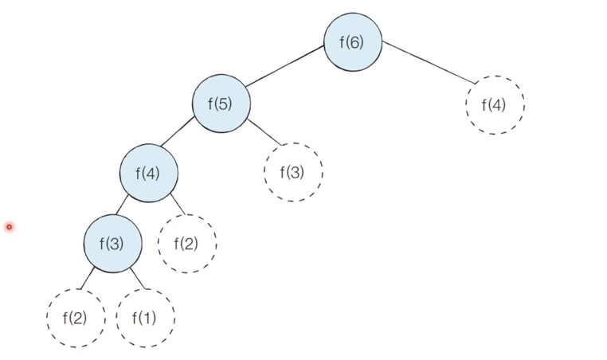

# 동적 프로그래밍(Dynamic Programming, 다이나믹 프로그래밍)
> `다이나믹`이라는 단어는 별다른 의미 없이 사용된 단어이다.

코드의 개선 방법으로 그리디, 완전 탐색 등으로 문제를 해결할 수 없거나 작성된 코드가 너무 많은 시간복잡도가 소요된다는 판단이 들면 다이나믹 프로그래밍을 활용할 수 있다.

## 특징
- 메모리를 적절히 사용하여 수행 시간 효율성을 비약적으로 향상시킬 수 있다.
- 이미 계산된 결과는 별도의 메모리 영역에 저장하여 다시 계산하지 않도록 한다.

### 시간복잡도가 많이 소요되는 가장 큰 원인
1. 불필요한 재귀 호출
    - 복잡한 문제는 재귀로 간단하게 표현이 가능하나, 재귀는 종종 O(2^N)의 지수 시간 복잡도를 가진다.

2. 하위 중첩 문제
    - 어떤 문제의 정답을 작은 문제의 정답에서 구할 수 있음에도 동일한 연산을 반복적으로 수행하는 문제.
    - 위 그림에서처럼 `f(2)`의 값은 변함이 없음에도 `f(6)`을 구하기 위해 반복적으로 연산하면서 비효율적인 문제가 생긴다.


  > `f(2)`가 여러 번 호출되는 것을 확인할 수 있음

## 적용 조건
1. 큰 문제를 작은 문제로 나눌 수 있으며, 작은 문제의 답을 모아 큰 문제를 해결할 수 있다. 
2. 동일한 작은 문제를 반복적으로 해결해야 할 때 

## 구현방법
### 1. 하향식(Top-Down) 방식: 재귀 + 메모이제이션
- 재귀
  - 직관적으로 표현되는 장점이 있다.
  - 재귀가 더 직관적이면 재귀를 사용하되, 메모이제이션으로 빠르게 만들어야 한다. 
- 메모이제이션(memoization)
  - 한 번 계산한 결과를 메모리 공간에 메모하는 기법이다.
  - 같은 문제를 다시 호출하면 메모했던 결과를 그대로 가져온다.
  - 값을 기록해 놓는다는 점에서 캐싱이라고도 한다.
- 하위 문제에 대한 정답을 계산했는지 확인해가면서 문제를 자연스러운 방식으로 풀어나간다.

### 2. 상향식(Bottom-Up) 방식: 반복문 +  메모이제이션
- 메모이제이션을 사용하더라도 재귀가 반복에 비해 오버헤드가 더 들기 때문에 재귀가 매우 직관적이지 않는 이상 상향식을 택하는 편이 낫다. 재귀는 어떻게 사용하든 컴퓨터는 호출 스택에 모든 호출을 기록해야 하므로 메모리를 소모하기 때문이다.
- 더 작은 하위 문제부터 살펴본 다음, 작은 문제의 정답을 이용해 큰 문제의 정답을 풀어나간다.
- 결과 저장용 리스트를 `DP테이블`이라고 부른다.

## 시간 복잡도 공간복잡도

- 시간복잡도: O(N)

## [예시] 피보나치 수열
> 하기 내용은 피보나치 수열을 풀이한 방식을 비교한 내용이다.

> 피보나치 수열(Fibonacci sequence)
>    - 0과 1로 시작하며 이어지는 수는 수열의 앞 두 수의 합인 무한대로 이어지는 수학적 수열
>    - 0, 1, 1, 2, 3, 5, 8, 13, 21, 34, 55, ...

### 1. 재귀함수
```python
def fib(n):
  if n == 0 or n == 1:
    return n

  return fib(n-2) + fib(n-1)
```
- 시간복잡도: O(2^N)

### 2. 하향식 기법 활용하기(재귀 + 메모이제이션)
```python
def fib(n, memo): # memo: 해시 테이블
  if n == 0 or n == 1:
    return n
  if n not in memo:
    memo[n] = fib(n - 2, memo) + fib(n - 1, memo)
  
  return memo[n]
```
- 먼저 계산한 함수 결과를 기억해 재귀 호출을 감소시킴
- 시간복잡도: O(2N - 1) => O(N)

### 3. 상향식 기법 활용하기(반복문 + 메모이제이션)
  ```python
  def fib(n):
    if n == 0:
      return 0
    
    a = 0
    b = 1

    for i in range(1, n):
      temp = a
      a = b
      b = temp + a
    
    return b
  ```
- 하위 문제를 중복 호출하지 않음
- 시간복잡도: O(N)

## 활용 문제
1. SWEA
    1. [SWEA - 5255. 타일 붙이기](https://swexpertacademy.com/main/learn/course/subjectDetail.do?courseId=AVuPDYSqAAbw5UW6&subjectId=AWUYNNbK29EDFAVT#)
    2. [SWEA - 5256. 이항계수](https://swexpertacademy.com/main/learn/course/subjectDetail.do?courseId=AVuPDYSqAAbw5UW6&subjectId=AWUYNNbK29EDFAVT#)
    3. [SWEA - 5258. 해피박스](https://swexpertacademy.com/main/learn/course/subjectDetail.do?courseId=AVuPDYSqAAbw5UW6&subjectId=AWUYNxvq3BIDFAVT)
    4. [SWEA - 5260. 부분 집합의 합](https://swexpertacademy.com/main/learn/course/subjectDetail.do?courseId=AVuPDYSqAAbw5UW6&subjectId=AWUYNxvq3BIDFAVT)
    5. [SWEA - 5262. 정렬된 부분 집합](https://swexpertacademy.com/main/learn/course/subjectDetail.do?courseId=AVuPDYSqAAbw5UW6&subjectId=AWUYODN63DsDFAVT)
    6. [SWEA - 5263. 그래프 최소 비용](https://swexpertacademy.com/main/learn/course/subjectDetail.do?courseId=AVuPDYSqAAbw5UW6&subjectId=AWUYODN63DsDFAVT)
    7. [SWEA - 5265. 전기카트 2](https://swexpertacademy.com/main/learn/course/subjectDetail.do?courseId=AVuPDYSqAAbw5UW6&subjectId=AWUYODN63DsDFAVT)
2. [프로그래머스 - 동적계획법](https://school.programmers.co.kr/learn/courses/30/parts/12263)
    1. [N으로 표현](https://school.programmers.co.kr/learn/courses/30/lessons/42895)
    2. [정수 삼각형](https://school.programmers.co.kr/learn/courses/30/lessons/43105)
    3. [등굣길](https://school.programmers.co.kr/learn/courses/30/lessons/42898)
    4. [도둑질](https://school.programmers.co.kr/learn/courses/30/lessons/42897)

## 관련 기술면접 질문
1. Dynamic Programming이란? DP의 장점은 무엇인가.
    <details>
    <summary>답변</summary>
    <p>
      - 이전의 결과값들을 저장해서 처리 속도를 향상시키는 프로그래밍 기법으로 불필요한 재귀 호출을 줄이고, 동일한 연산을 반복하는 것을 막아 코드를 개선할 수 있는 장점이 있다.
      - 피보나치 수열을 재귀함수로만 푼다면 시간복잡도가 O(2^N)인 지수 복잡도를 갖지만, DP기법을 활용하면 O(N)의 시간복잡도로 줄일 수 있다.
    </p>
    </details>
2. Dynamic Programming과 분할정복의 공통점과 차이점은?
    <details>
    <summary>답변</summary>
    <p>
  
      - 공통점: 두 기법 모두 큰 문제를 작은 문제로 나눌 수 있으며 작은 문제의 답을 모아서 큰 문제를 해결할 수 있는 상황에서 활용할 수 있다.

      - 차이점: 다이나믹 프로그래밍은 각 부분 문제들이 서로 영향을 미치며 부분 문제가 중복되지만, 분할 정복은 동일한 문제가 반복적으로 계산되지는 않는다.
          - 대표적인 분할정복: 퀵 정렬
              - 한 번 기본 원소가 자리를 변경해서 자리를 잡으면 그 기준 원소의 위치는 바뀌지 않는다.
              - 분할 이후, 해당 피벗을 다시 처리하는 부분 문제는 호출하지 않는다.
    </p>
    </details>

## 참고 자료
- [누구나 자료구조와 알고리즘](http://www.yes24.com/Product/Goods/61941073)
- [이것이 취업을 위한 코딩 테스트다](http://www.yes24.com/Product/Goods/91433923)
- [알고리즘 - Dynamic Programming(동적프로그래밍)이란?](https://galid1.tistory.com/507)
- [(이코테 2021 강의 몰아보기) 6. 다이나믹 프로그래밍](https://www.youtube.com/watch?v=5Lu34WIx2Us&t=1620)