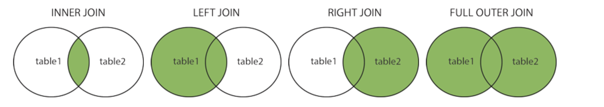

# SQL
[SQL이란?](#sqlstructured-query-language)

[SQL문 - DB편](#db-관련-sql문)

[SQL문 - TABLE편](#table-관련-sql문)

[SQL문 - 레코드/컬럼편(DML, 조작)](#레코드컬럼별-sql문---dml조작)

[1. SQLite 집계합수(Aggregate Functions)](#sqlite-집계함수aggregate-functions)

[2. LIKE문](#like)

[3. ORDER BY문](#order-by)

[4. GROUP BY문](#group-by)

[5. ALTER문](#alter-table)

[6. JOINs](#joins)

## SQL(Structured Query Language)
- 관계형 데이터 베이스 관리시스템의 데이터 관리 를 위해 설계된 특수 목적으로 사용되는 프로그래밍 언어(DB를 조작하기 위해 만들어진 언어)
- 데이터 베이스 스키마 생성 및 수정
- 자료의 검색 및 관리
- 데이터 베이스 객체 접근 조정 관리

## SQL 분류
1. DDL(정의) - CREATE, DROP, ALTER
2. DML(조작)
   1. INSERT: 새로운 데이터 삽입/추가
   2. SELECT: 저장되어 있는 데이터 조회 
   3. UPDATE: 저장되어 있는 데이터 갱신
   4. DELETE: 저장되어 있는 데이터 삭제
3. DCL(제어) - GRANT, REVOKE, COMMIT, ROLLBACK

## DB 관련 SQL문
1. DB 생성
    ```bash
    sqlite3 데이터베이스명.sqlite3
    ```
    > 확장자는 `.db`, `.sqlite`, `.sqlite3`, 또는 없어도 되진만 확장자만으로도 파악이 가능하도록 지정하는 것을 권장한다.

2. 현재 연결된 데이터베이스가 저장되는 파일명/위치 조회
    ```sql
    .databases
    ```

3. 출력 모드 설정
    ```sql
    .mode 출력모드
    ```
    > `ascii` : ascii형식으로 출력
    > 
    > `column` : 컬럼으로 구분하여 출력
    >
    > `csv` : 콤마(,)로 구분하여 한 줄씩 출력
    >
    > `html` : HTML 테이블 형식으로 출력
    >
    > `insert` : INSERT 구문 형식으로 출력
    >
    > `list` : 열(|) 표시로 구분하여 출력
    >
    > `quote` : 숫자는 그대로, 문자열은 ''를 사용하여 출력
    >
    > `tabs` : 탭으로 구분하여 출력
    >
    > `tcl` : TCL의 List 형식

4. 외부 파일 import해서 table 생성하기
    ```sql
    .import 외부파일명(확장자 포함) 테이블명
    ```
    > 외부파일을 지정한 테이블명으로 table 생성

## TABLE 관련 SQL문
1. table 조회하기
    ```sql
    .tables
    ```

2. table 컬럼명과 형식 모두 조회하기
    ```sql
    .schema 테이블명
    ```

3. 테이블 생성하기
    ```sql
    CREATE TABLE 테이블명 (
      컬럼명 형식 PRIMARY KEY(기본키),
      컬럼명 형식 NOT NULL(빈값 허용X),
      컬럼명 형식
    );
    ```

4. 테이블 삭제하기
    ```sql
    DROP TABLE 테이블명;
    ```

## 레코드/컬럼별 SQL문 - DML(조작)
1. INSERT: 특정 테이블에 레코드(행) 생성하기
    ```sql
    INSERT INTO 테이블명 (컬럼1, 컬럼2, ...) VALUES (값1, 값2, ...);
    ```
    > 모든 열에 데이터를 삽입하는 경우, clolumn을 명시하지 않아도 됨

2. SELECT: 테이블에서 데이터 조회
    - 테이블 전체 조회
        ```sql
        SELECT * FROM 테이블명;
        ```

    - rowid와 함께 테이블 전체 조회
        ```sql
        SELECT rowid, * FROM 테이블명;
        ```
        > SQLite는 따로 PRIMARY KEY 속성의 컬럼을 작성하지 않으면 값이 자동으로 증가하는 PK 옵션을 가진 `rowid` 컬럼을 정의하고 있다.
    
    - 다양한 절과 함께 사용
        - `ORDER BY`
        - `DISTINCT` : 조회 결과에서 중복 행을 제거하며 `SELECT` 키워드 바로 뒤에 작성해야 한다.
        - `WHERE` : 특정 검색 조건을 지정한다.
        - `LIMIT` : 반환되는 행 수 제한하는 절로 특정 행부터 시작해서 조회하기 위해 `OFFSET`과 함께 사용하기도 한다.
        - `GROUP BY`

3. DELETE: 테이블에서 행을 제거
    ```sql
    DELETE FROM 테이블명 WHERE 조건;
    ```
    > SQLite는 기본적으로 id를 재사용한다. 
    >
    > (예) 5번 레코드를 지우고 새로운 레코드를 생성하면 5번 rowid를 갖는다.

    > rowid 재사용없이 다음 행 값을 사용하게 하려면, id에 `AUTOINCREMENT` 설정을 해야함
    >
    > (예) `id INTEGER PRIMARY KEY AUTOINCREMENT`

4. UPDATE: 기존 행 데이터 수정
    ```sql
    UPDATE 테이블명 SET 컬럼1=값1, 컬럼2=값2, ... WHERE 조건;
    ```

## SQLite 집계함수(Aggregate Functions)
1. `COUNT` : 레코드 개수 조회
    ```sql
    SELECT COUNT(컬럼) FROM 테이블명;
    ```
2. `AVG` : 값 집합의 평균 값을 계산
    ```sql
    SELECT AVG(컬럼) FROM 테이블명;
    ```
3. `MAX` : 그룹에 모든 값의 최대값을 가져옴
    ```sql
    SELECT MAX(컬럼) FROM 테이블명;
    ```
4. `MIN` : 그룹에 있는 모든 값의 최소값을 가져옴
    ```sql
    SELECT MIN(컬럼) FROM 테이블명;
    ```
5. `SUM` : 모든 값의 합을 계산
    ```sql
    SELECT SUM(컬럼) FROM 테이블명;
    ```

## LIKE
- 패턴 일치를 기반으로 데이터를 조회
- wildcards
    1. `%` : 0개 이상의 문자로, 이자리에 문자열이 있을수도 없을 수도 있다.
    2. `_` : 임의의 단일 문자로, 반드시 이 자리에 한 개의 문자가 존재해야 한다.
    ```bash
    2% : 2로 시작하는 값
    %2 : 2로 끝나는 값
    %2% : 2가 들어가는 값
    _2% : 두번째가 2로 시작하는 값
    1___ : 1로 시작하는 4자리 값
    2_%_%, 2__% : 2로 시작하고 적어도 3자리인 값
    ```

## ORDER BY
- 조회 결과 집합을 정렬
- 정렬 기준
    1. `ASC` : 오름차순(기본값)
    2. `DESC` : 내림차순
    ```sql
    SELECT * FROM 테이블명 ORDER BY 컬럼1, 컬럼2 ASC(or DESC);
    ```

## GROUP BY
- 행 집합에서 요약행 집합을 만듬
  ```sql
  SELECT 컬럼1, aggregate함수(컬럼2) FROM 테이블 GROUP BY 컬럼1, 컬럼2;
  ```

## `ALTER` TABLE
1. table 이름 변경
    ```sql
    ALTER TABLE 현재테이블명 RENAME TO 새테이블명;
    ```
2. 테이블에 새로운 column 추가
    ```sql
    ALTER TABLE 테이블명 ADD COLUMN 컬럼명 데이터타입 (NOT NULL);
    ```
    > `NOT NULL` 설정시 기존 레코드에는 해당 컬럼값이 없어서 오류 발생
    > 
    > [해결방법]
    > 
    > 1. `NOT NULL` 없이 컬럼 추가
    > 
    > 2. 컬럼 추가하면서 기본값 설정하기
    > 
    >     `ALTER TABLE 테이블명 ADD COLUMN 컬럼명 데이터타입 NOT NULL DEFAULT 기본값;`
3. column 이름 수정
    ```sql
    ALTER TALBE 테이블명
    RENAME COLUMN 현재컬럼명 TO 새컬럼명;
    ```

## JOINs
```sql
    SELECT 컬럼1, 컬럼2, 컬럼3, ...
    FROM 테이블1
    JOIN 테이블2
    ON 두 테이블의 연결 조건;
```
> ON 조건절
> - 컬럼명이 다르더라도 JOIN 조건을 사용할 수 있다. 
>       (예) `테이블1.컬럼명 = 테이블2.컬럼명`
> - ON 조건절 안에 WHERE 기능처럼 조건을 추가할 수 있다.
> 
> USING 조건절
> - 같은 이름을 가진 컬럼들 중에서 원하는 컬럼에 대해서만 JOIN할 수 있다.
> - sql server에서는 지원하지 않음
> - 조건을 무조건 괄호 안에 적어야 한다.



1. (INNER) JOIN : 공통 레코드 반환
2. LEFT (OUTER) JOIN : 왼쪽 레코드 전체 + 공통된 오른쪽 레코드 반환
3. RIGHT (OUTER) JOIN : 오른쪽 레코드 전체 + 공통된 왼쪽 레코드 반환
4. FULL (OUTER) JOIN : 왼쪽 레코드 전체 + 오른쪽 레코드 전체 반환

> *Error: RIGHT and FULL OUTER JOINs are not currently supported*
>
> > SQLite는 왼쪽 외부 조인을 하는 `JOIN`과 `LEFT JOIN`만 지원하고 있어서 발생하는 에러
